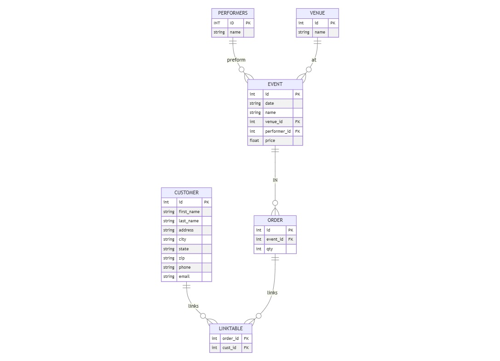

# Design Document
By Ron Renninger
Video overview: https://youtu.be/C54_Jo0X5bs
## Scope
In this section you should answer the following questions:
The database for CS50 SQL includes all entities to keep track of ticket sales. The database scope is:
* Customer, including basic customer information.
* Orders, including event ID and how many tickets were bought.
* Linktable, links the customer table and the order table.
* Events, store the information about the event.
* Venue, store the name of the venue.
* Performers, store the names of the performers.
Out of scope are elements like the number of tickets for each event, and assigned seating.
## Functional Requirements
This database will support:
•	CRUD operations for customers and ticket salespersons
•	Keep track of which customers that bought tickets for a certain event.
Note that in this iteration, the system will not support customer to return tickets.
In this section you should answer the following questions:
## Representation
Entities are captured in SQLite tables with the following schema.
### Entities
Customer
Column
Name	    Data Type	Constraints	Key	        Null	Notes
Id	        Integer		            Primary Key
first_name	Text			                    Not
last_name	Text			                    Not
Address	    Text			                    Not
City	    Text			                    Not
State	    Text			                    Not
Zip	        Text			                    Not
Phone	    Text	    unique		            Not
email	    Text	    unique		            Not

Order
Column
Name	    Data Type	Constraints	Key	        Null	Notes
Id	        Integer		            Primary Key
Event_id	Integer		            Foreign Key Not
                                    From events
                                    table
qty	        integer			                    Not

Linktable
Column
Name	    Data Type	Constraints	Key	        Null	Notes
Order_id	Integer		            Foreign Key
                                    From orders
                                    table
Cust_id	    integer		            Foreign key
                                    from customer
                                    table

Events
Column
Name	    Data Type	Constraints	Key	        Null	Notes
Id	        Integer		            Primary Key
Date	    Text			                    Not
Name	    Text			                    not
Venue_id	Integer		            Foreign Key
                                    from venue
                                    table
Performer_id Integer		        Foreign key
                                    from performer
                                    table
price	     Numeric	Check price
                         != 0

Venue
Column
Name	    Data Type	Constraints	Key 	    Null	Notes
Id	        Integer		            Primary Key
name	    text			                    not

Performers
Column
Name	    Data Type	Constraints	Key	        Null	Notes
Id	        Integer		            Primary Key
Name	    text			                    not

### Relationships

One customer is capable of making 0 to many orders. 0 if they have not placed any orders and many if placed an order.
An order is associated with one and only one order. But a customer can have 0 to many orders.
Orders and customers are linked using the linktable.
An event is capable of making 0 to many orders. 0 if they have no tickets sold. Many if one or more tickets are sold.
An event can have one and only one performer but a performer can have 0 to many events.
An event can have one and only one venue but a venue can have 0 to many venues.
## Optimizations
To speed up searches there are three indexes.
Customer_search having first name, last name, phone and email.
Performers_search having performer name.
Venue_search having the venue name.
It also has one view called orderdeatails containing
From the customer table – first name, last name, phone, email
From the event table – price and event name
From the order table – number of tickets sold
Total price = price and number of tickets
## Limitations
The current schema assumes buying tickets for one event at a time. No way to update or change orders.

